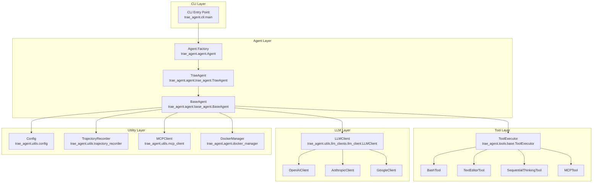
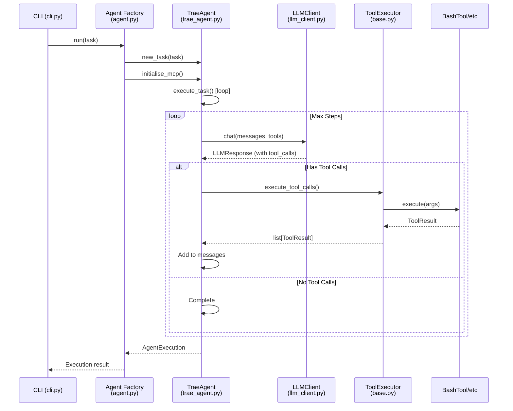
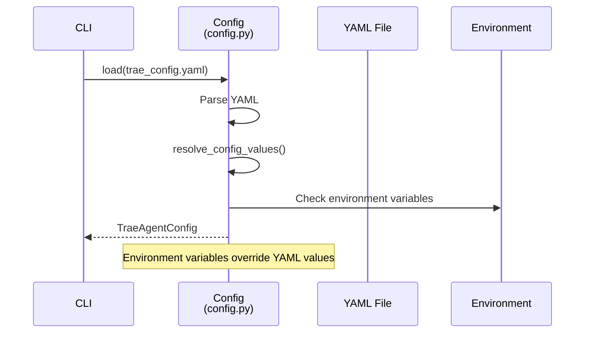

# Trae Agent - Code Wiki

---
title: "Trae Agent Code Wiki"
description: "Comprehensive technical documentation for the Trae Agent codebase"
---

## Table of Contents

1. [Project Overview](#1-project-overview)
2. [Architecture](#2-architecture)
3. [Module Structure](#3-module-structure)
4. [Core Classes and Functions](#4-core-classes-and-functions)
5. [Data Flow](#5-data-flow)
6. [Configuration System](#6-configuration-system)
7. [Tool System](#7-tool-system)
8. [LLM Integration](#8-llm-integration)
9. [MCP Support](#9-mcp-support)
10. [Docker Mode](#10-docker-mode)
11. [Trajectory Recording](#11-trajectory-recording)
12. [Running the Project](#12-running-the-project)

---

## 1. Project Overview

**Trae Agent** is an LLM-based agent for general purpose software engineering tasks, developed by ByteDance. It provides a powerful CLI interface that understands natural language instructions and executes complex software engineering workflows using various tools and LLM providers.

### Key Characteristics

- **Research-Friendly Design**: Transparent, modular architecture that researchers and developers can easily modify, extend, and analyze
- **Multi-LLM Support**: Works with OpenAI, Anthropic, Doubao, Azure, OpenRouter, Ollama, and Google Gemini APIs
- **Rich Tool Ecosystem**: File editing, bash execution, sequential thinking, and more
- **Interactive Mode**: Conversational interface for iterative development
- **Trajectory Recording**: Detailed logging of all agent actions for debugging and analysis
- **Flexible Configuration**: YAML-based configuration with environment variable support
- **Docker Support**: Run tasks in isolated Docker containers

### Technical Stack

| Component | Technology |
|-----------|------------|
| Language | Python >= 3.12 |
| LLM Clients | OpenAI SDK, Anthropic SDK, Google GenAI |
| CLI | Click, Rich |
| MCP | Model Context Protocol (MCP) |
| Container | Docker SDK |
| Testing | pytest, pytest-asyncio |

*Source: [`pyproject.toml`](https://github.com/bytedance/trae-agent/blob/main/pyproject.toml)*

---

## 2. Architecture

### 2.1 High-Level Architecture



### 2.2 Component Responsibilities

| Component | Responsibility | Key File |
|-----------|----------------|----------|
| CLI | Command-line interface, argument parsing, docker detection | `trae_agent/cli.py` |
| Agent | Factory for creating agents, task execution orchestration | `trae_agent/agent/agent.py` |
| TraeAgent | Main agent logic for software engineering tasks | `trae_agent/agent/trae_agent.py` |
| BaseAgent | Abstract base class with core agent loop | `trae_agent/agent/base_agent.py` |
| LLMClient | Router to specific LLM provider clients | `trae_agent/utils/llm_clients/llm_client.py` |
| ToolExecutor | Manages tool execution (parallel/sequential) | `trae_agent/tools/base.py` |
| Config | Configuration management (YAML/JSON/env) | `trae_agent/utils/config.py` |
| TrajectoryRecorder | Records execution trajectories | `trae_agent/utils/trajectory_recorder.py` |
| MCPClient | MCP server connection management | `trae_agent/utils/mcp_client.py` |
| DockerManager | Docker container lifecycle management | `trae_agent/agent/docker_manager.py` |

*Sources: [`trae_agent/__init__.py:6-11`](https://github.com/bytedance/trae-agent/blob/main/trae_agent/__init__.py), [`trae_agent/agent/__init__.py`](https://github.com/bytedance/trae-agent/blob/main/trae_agent/agent/__init__.py)*

---

## 3. Module Structure

### 3.1 Directory Structure

```
trae-agent/
├── trae_agent/                 # Main package
│   ├── __init__.py            # Package exports
│   ├── cli.py                 # CLI entry point
│   ├── agent/                 # Agent implementations
│   │   ├── __init__.py
│   │   ├── agent.py           # Agent factory
│   │   ├── agent_basics.py    # Agent state/step types
│   │   ├── base_agent.py      # Abstract base agent
│   │   ├── trae_agent.py      # Main TraeAgent implementation
│   │   └── docker_manager.py  # Docker lifecycle
│   ├── tools/                 # Tool implementations
│   │   ├── __init__.py        # Tool registry
│   │   ├── base.py            # Tool base classes
│   │   ├── bash_tool.py        # Bash execution tool
│   │   ├── bash_tool.py        # Bash execution
│   │   ├── edit_tool.py        # File editing tool
│   │   ├── json_edit_tool.py   # JSON editing
│   │   ├── sequential_thinking_tool.py
│   │   ├── task_done_tool.py
│   │   ├── ckg_tool.py
│   │   ├── mcp_tool.py        # MCP tool wrapper
│   │   └── ...
│   ├── llm/                   # LLM client implementations
│   │   ├── llm_client.py      # Main LLMClient
│   │   ├── base_client.py     # Abstract base
│   │   ├── llm_basics.py      # LLM types
│   │   ├── openai_client.py
│   │   ├── anthropic_client.py
│   │   ├── google_client.py
│   │   └── ...
│   ├── utils/                 # Utilities
│   │   ├── config.py          # Configuration
│   │   ├── trajectory_recorder.py
│   │   ├── mcp_client.py
│   │   ├── cli.py             # CLI console
│   │   └── ...
│   ├── prompt/                # System prompts
│   │   └── agent_prompt.py
│   └── ...
├── server/                    # HTTP server (optional)
├── tests/                     # Test suite
├── evaluation/                # Evaluation framework
├── docs/                     # Documentation
└── pyproject.toml
```

### 3.2 Package Exports

```python
# trae_agent/__init__.py
from trae_agent.agent.base_agent import BaseAgent
from trae_agent.agent.trae_agent import TraeAgent
from trae_agent.tools.base import Tool, ToolExecutor
from trae_agent.utils.llm_clients.llm_client import LLMClient

__all__ = ["BaseAgent", "TraeAgent", "LLMClient", "Tool", "ToolExecutor"]
```

*Source: [`trae_agent/__init__.py`](https://github.com/bytedance/trae-agent/blob/main/trae_agent/__init__.py)*

---

## 4. Core Classes and Functions

### 4.1 Agent Classes

#### BaseAgent (Abstract)

```python
# trae_agent/agent/base_agent.py
class BaseAgent(ABC):
    """Base class for LLM-based agents."""

    _tool_caller: Union[ToolExecutor, DockerToolExecutor]

    def __init__(
        self,
        agent_config: AgentConfig,
        docker_config: dict | None = None,
        docker_keep: bool = True
    ):
        self._llm_client = LLMClient(agent_config.model)
        self._model_config = agent_config.model
        self._max_steps = agent_config.max_steps
        self._tools: list[Tool] = [...]
        self.docker_manager: DockerManager | None = None
```

**Key Methods:**
- `__init__()`: Initialize agent with configuration
- `set_cli_console()`: Set CLI console for output
- `set_trajectory_recorder()`: Set trajectory recorder
- `execute_task()`: Main execution loop (abstract)
- `new_task()`: Initialize a new task
- `initialise_mcp()`: Initialize MCP servers
- `cleanup_mcp_clients()`: Cleanup MCP connections

*Source: [`trae_agent/agent/base_agent.py:29-61`](https://github.com/bytedance/trae-agent/blob/main/trae_agent/agent/base_agent.py)*

#### TraeAgent

```python
# trae_agent/agent/trae_agent.py
class TraeAgent(BaseAgent):
    """Trae Agent specialized for software engineering tasks."""

    TraeAgentToolNames = [
        "str_replace_based_edit_tool",
        "sequentialthinking",
        "json_edit_tool",
        "task_done",
        "bash",
    ]

    def __init__(
        self,
        trae_agent_config: TraeAgentConfig,
        docker_config: dict | None = None,
        docker_keep: bool = True,
    ):
        self.project_path: str = ""
        self.base_commit: str | None = None
        self.must_patch: str = "false"
        self.patch_path: str | None = None
        self.mcp_servers_config: dict[str, MCPServerConfig] | None = None
        self.allow_mcp_servers: list[str] | None = None
```

*Source: [`trae_agent/agent/trae_agent.py:17-50`](https://github.com/bytedance/trae-agent/blob/main/trae_agent/agent/trae_agent.py)*

#### Agent Factory

```python
# trae_agent/agent/agent.py
class Agent:
    def __init__(
        self,
        agent_type: AgentType | str,
        config: Config,
        trajectory_file: str | None = None,
        cli_console: CLIConsole | None = None,
        docker_config: dict | None = None,
        docker_keep: bool = True,
    ):
        match self.agent_type:
            case AgentType.TraeAgent:
                self.agent: TraeAgent = TraeAgent(...)

    async def run(
        self,
        task: str,
        extra_args: dict[str, str] | None = None,
        tool_names: list[str] | None = None,
    ) -> Execution:
```

*Source: [`trae_agent/agent/agent.py:12-65`](https://github.com/bytedance/trae-agent/blob/main/trae_agent/agent/agent.py)*

### 4.2 Agent State Types

```python
# trae_agent/agent/agent_basics.py

class AgentStepState(Enum):
    """States during agent execution."""
    THINKING = "thinking"
    CALLING_TOOL = "calling_tool"
    REFLECTING = "reflecting"
    COMPLETED = "completed"
    ERROR = "error"

class AgentState(Enum):
    """Overall agent state."""
    IDLE = "idle"
    RUNNING = "running"
    COMPLETED = "completed"
    ERROR = "error"

@dataclass
class AgentStep:
    step_number: int
    state: AgentStepState
    thought: str | None = None
    tool_calls: list[ToolCall] | None = None
    tool_results: list[ToolResult] | None = None
    llm_response: LLMResponse | None = None
    reflection: str | None = None
    error: str | None = None

@dataclass
class AgentExecution:
    task: str
    steps: list[AgentStep]
    final_result: str | None = None
    success: bool = False
    total_tokens: LLMUsage | None = None
    execution_time: float = 0.0
    agent_state: AgentState = AgentState.IDLE
```

*Source: [`trae_agent/agent/agent_basics.py`](https://github.com/bytedance/trae-agent/blob/main/trae_agent/agent/agent_basics.py)*

### 4.3 Tool System

#### Tool Base Class

```python
# trae_agent/tools/base.py

class Tool(ABC):
    """Base class for all tools."""

    def __init__(self, model_provider: str | None = None):
        self._model_provider = model_provider

    @abstractmethod
    def get_name(self) -> str:
        """Get the tool name."""

    @abstractmethod
    def get_description(self) -> str:
        """Get the tool description."""

    @abstractmethod
    def get_parameters(self) -> list[ToolParameter]:
        """Get the tool parameters."""

    @abstractmethod
    async def execute(self, arguments: ToolCallArguments) -> ToolExecResult:
        """Execute the tool with given parameters."""

    def json_definition(self) -> dict[str, object]:
        """Get JSON schema for tool."""
        return {
            "name": self.name,
            "description": self.description,
            "parameters": self.get_input_schema(),
        }
```

*Source: [`trae_agent/tools/base.py:62-98`](https://github.com/bytedance/trae-agent/blob/main/trae_agent/tools/base.py)*

#### ToolExecutor

```python
# trae_agent/tools/base.py

class ToolExecutor:
    """Manages tool execution."""

    def __init__(self, tools: list[Tool]):
        self._tools = tools
        self._tool_map: dict[str, Tool] | None = None

    async def execute_tool_call(self, tool_call: ToolCall) -> ToolResult:
        """Execute a single tool call."""
        normalized_name = self._normalize_name(tool_call.name)
        tool = self.tools[normalized_name]
        tool_exec_result = await tool.execute(tool_call.arguments)
        return ToolResult(...)

    async def parallel_tool_call(self, tool_calls: list[ToolCall]) -> list[ToolResult]:
        """Execute tool calls in parallel."""
        return await asyncio.gather(*[self.execute_tool_call(call) for call in tool_calls])

    async def sequential_tool_call(self, tool_calls: list[ToolCall]) -> list[ToolResult]:
        """Execute tool calls sequentially."""
        return [await self.execute_tool_call(call) for call in tool_calls]
```

*Source: [`trae_agent/tools/base.py:147-181`](https://github.com/bytedance/trae-agent/blob/main/trae_agent/tools/base.py)*

#### Tool Registry

```python
# trae_agent/tools/__init__.py

tools_registry: dict[str, type[Tool]] = {
    "bash": BashTool,
    "str_replace_based_edit_tool": TextEditorTool,
    "json_edit_tool": JSONEditTool,
    "sequentialthinking": SequentialThinkingTool,
    "task_done": TaskDoneTool,
    "ckg": CKGTool,
}
```

*Source: [`trae_agent/tools/__init__.py`](https://github.com/bytedance/trae-agent/blob/main/trae_agent/tools/__init__.py)*

### 4.4 LLM Client System

#### LLMClient Router

```python
# trae_agent/utils/llm_clients/llm_client.py

class LLMClient:
    """Main LLM client that supports multiple providers."""

    def __init__(self, model_config: ModelConfig):
        self.provider: LLMProvider = LLMProvider(model_config.model_provider.provider)
        match self.provider:
            case LLMProvider.OPENAI:
                from .openai_client import OpenAIClient
                self.client: BaseLLMClient = OpenAIClient(model_config)
            case LLMProvider.ANTHROPIC:
                from .anthropic_client import AnthropicClient
                self.client = AnthropicClient(model_config)
            # ... other providers
```

*Source: [`trae_agent/utils/llm_clients/llm_client.py:25-49`](https://github.com/bytedance/trae-agent/blob/main/trae_agent/utils/llm_clients/llm_client.py)*

#### Supported Providers

| Provider | Enum Value | Client Class |
|----------|------------|--------------|
| OpenAI | `OPENAI` | `OpenAIClient` |
| Anthropic | `ANTHROPIC` | `AnthropicClient` |
| Azure | `AZURE` | `AzureClient` |
| Ollama | `OLLAMA` | `OllamaClient` |
| OpenRouter | `OPENROUTER` | `OpenRouterClient` |
| Doubao | `DOUBAO` | `DoubaoClient` |
| Google Gemini | `GOOGLE` | `GoogleClient` |

*Source: [`trae_agent/utils/llm_clients/llm_client.py:10-20`](https://github.com/bytedance/trae-agent/blob/main/trae_agent/utils/llm_clients/llm_client.py)*

#### BaseLLMClient

```python
# trae_agent/utils/llm_clients/base_client.py

class BaseLLMClient(ABC):
    """Base class for LLM clients."""

    def __init__(self, model_config: ModelConfig):
        self.api_key: str = model_config.model_provider.api_key
        self.base_url: str | None = model_config.model_provider.base_url
        self.trajectory_recorder: TrajectoryRecorder | None = None

    @abstractmethod
    def chat(
        self,
        messages: list[LLMMessage],
        model_config: ModelConfig,
        tools: list[Tool] | None = None,
        reuse_history: bool = True,
    ) -> LLMResponse:
        """Send chat messages to the LLM."""
```

*Source: [`trae_agent/utils/llm_clients/base_client.py`](https://github.com/bytedance/trae-agent/blob/main/trae_agent/utils/llm_clients/base_client.py)*

---

## 5. Data Flow

### 5.1 Task Execution Flow



### 5.2 Configuration Loading Flow



---

## 6. Configuration System

### 6.1 Configuration Structure

```python
# trae_agent/utils/config.py

@dataclass
class TraeAgentConfig:
    enable_lakeview: bool
    model: ModelConfig
    max_steps: int
    tools: list[str]
    mcp_servers_config: dict[str, MCPServerConfig] | None = None
    allow_mcp_servers: list[str] | None = None

@dataclass
class ModelConfig:
    model: str
    model_provider: ModelProvider
    temperature: float
    top_p: float
    top_k: int
    parallel_tool_calls: bool
    max_retries: int
    max_tokens: int | None = None
    supports_tool_calling: bool = True
    candidate_count: int | None = None
    stop_sequences: list[str] | None = None
    max_completion_tokens: int | None = None

@dataclass
class ModelProvider:
    api_key: str
    provider: str
    base_url: str | None = None
    api_version: str | None = None
```

*Source: [`trae_agent/utils/config.py`](https://github.com/bytedance/trae-agent/blob/main/trae_agent/utils/config.py)*

### 6.2 Configuration File Example (YAML)

```yaml
# trae_config.yaml
agents:
  trae_agent:
    enable_lakeview: true
    model: trae_agent_model
    max_steps: 200
    tools:
      - bash
      - str_replace_based_edit_tool
      - sequentialthinking

model_providers:
  anthropic:
    api_key: your_anthropic_api_key
    provider: anthropic
  openai:
    api_key: your_openai_api_key
    provider: openai
    base_url: https://openrouter.ai/api/v1

models:
  trae_agent_model:
    model_provider: anthropic
    model: claude-sonnet-4-20250514
    max_tokens: 4096
    temperature: 0.5

mcp_servers:
  playwright:
    command: npx
    args:
      - "@playwright/mcp@0.0.27"
```

*Source: [`trae_config.yaml.example`](https://github.com/bytedance/trae-agent/blob/main/trae_config.yaml.example)*

### 6.3 Configuration Priority

```
Command-line arguments > Configuration file > Environment variables > Default values
```

*Source: [`README.md`](https://github.com/bytedance/trae-agent/blob/main/README.md)*

---

## 7. Tool System

### 7.1 Available Tools

| Tool Name | Class | Description |
|-----------|-------|-------------|
| `bash` | `BashTool` | Execute bash commands in persistent session |
| `str_replace_based_edit_tool` | `TextEditorTool` | View, create, edit files |
| `json_edit_tool` | `JSONEditTool` | Edit JSON files |
| `sequentialthinking` | `SequentialThinkingTool` | Chain-of-thought reasoning |
| `task_done` | `TaskDoneTool` | Mark task as complete |
| `ckg` | `CKGTool` | Code knowledge graph |
| MCP tools | `MCPTool` | Dynamic MCP server tools |

*Source: [`trae_agent/tools/__init__.py`](https://github.com/bytedance/trae-agent/blob/main/trae_agent/tools/__init__.py)*

### 7.2 BashTool

```python
# trae_agent/tools/bash_tool.py

class BashTool(Tool):
    """Execute bash commands in a persistent session."""

    async def execute(self, arguments: ToolCallArguments) -> ToolExecResult:
        if arguments.get("restart"):
            self._session = _BashSession()
            await self._session.start()
            return ToolExecResult(output="tool has been restarted.")

        if self._session is None:
            self._session = _BashSession()
            await self._session.start()

        command = str(arguments["command"])
        return await self._session.run(command)
```

*Source: [`trae_agent/tools/bash_tool.py`](https://github.com/bytedance/trae-agent/blob/main/trae_agent/tools/bash_tool.py)*

### 7.3 TextEditorTool (File Editing)

```python
# trae_agent/tools/edit_tool.py

EditToolSubCommands = ["view", "create", "str_replace", "insert"]

class TextEditorTool(Tool):
    """View, create and edit files."""

    async def execute(self, arguments: ToolCallArguments) -> ToolExecResult:
        command = arguments.get("command")
        path = arguments.get("path")

        match command:
            case "view":
                return await self._view(path)
            case "create":
                return await self._create(path, arguments.get("file_text"))
            case "str_replace":
                return await self._str_replace(
                    path,
                    arguments.get("old_str"),
                    arguments.get("new_str")
                )
            case "insert":
                return await self._insert(path, arguments.get("new_str"), arguments.get("insert_line"))
```

*Source: [`trae_agent/tools/edit_tool.py`](https://github.com/bytedance/trae-agent/blob/main/trae_agent/tools/edit_tool.py)*

---

## 8. LLM Integration

### 8.1 Message Types

```python
# trae_agent/utils/llm_clients/llm_basics.py

@dataclass
class LLMMessage:
    role: str  # "user", "assistant", "system", "tool"
    content: str | None = None
    tool_call: ToolCall | None = None
    tool_result: ToolResult | None = None

@dataclass
class LLMResponse:
    content: str | None
    model: str
    finish_reason: str | None
    tool_calls: list[ToolCall] | None = None
    usage: LLMUsage | None = None
```

*Source: [`trae_agent/utils/llm_clients/llm_basics.py`](https://github.com/bytedance/trae-agent/blob/main/trae_agent/utils/llm_clients/llm_basics.py)*

### 8.2 Provider-Specific Clients

Each provider client implements the `BaseLLMClient` interface:

```python
# Example: OpenAI Client pattern
class OpenAIClient(BaseLLMClient):
    def chat(
        self,
        messages: list[LLMMessage],
        model_config: ModelConfig,
        tools: list[Tool] | None = None,
        reuse_history: bool = True,
    ) -> LLMResponse:
        # Use OpenAI SDK
        response = self.client.chat.completions.create(
            model=model_config.model,
            messages=[...],
            tools=[tool.json_definition() for tool in tools] if tools else None,
        )
        return LLMResponse(...)
```

---

## 9. MCP Support

### 9.1 MCP Client

```python
# trae_agent/utils/mcp_client.py

class MCPClient:
    """Manages MCP server connections."""

    def __init__(self):
        self.session: ClientSession | None = None
        self.exit_stack = AsyncExitStack()
        self.mcp_servers_status: dict[str, MCPServerStatus] = {}

    async def connect_and_discover(
        self,
        mcp_server_name: str,
        mcp_server_config: MCPServerConfig,
        mcp_tools_container: list,
        model_provider,
    ):
        params = StdioServerParameters(
            command=mcp_server_config.command,
            args=mcp_server_config.args,
            env=mcp_server_config.env,
            cwd=mcp_server_config.cwd,
        )
        transport = await self.exit_stack.enter_async_context(stdio_client(params))
        await self.connect_to_server(mcp_server_name, transport)
        mcp_tools = await self.list_tools()
        for tool in mcp_tools.tools:
            mcp_tool = MCPTool(self, tool, model_provider)
            mcp_tools_container.append(mcp_tool)
```

*Source: [`trae_agent/utils/mcp_client.py`](https://github.com/bytedance/trae-agent/blob/main/trae_agent/utils/mcp_client.py)*

### 9.2 MCP Server Configuration

```yaml
mcp_servers:
  playwright:
    command: npx
    args:
      - "@playwright/mcp@0.0.27"
  filesystem:
    command: uvx
    args:
      - mcp-server-filesystem
      - /allowed/path
```

---

## 10. Docker Mode

### 10.1 DockerManager

```python
# trae_agent/agent/docker_manager.py

class DockerManager:
    """Manages Docker container lifecycle."""

    CONTAINER_TOOLS_PATH = "/agent_tools"

    def __init__(
        self,
        image: str | None,
        container_id: str | None,
        dockerfile_path: str | None,
        docker_image_file: str | None,
        workspace_dir: str | None = None,
        tools_dir: str | None = None,
        interactive: bool = False,
    ):
        self.client = docker.from_env()
        self.image = image
        self.container_id = container_id
        # ...

    def start(self):
        """Start container, mount workspace, copy tools."""
        if self.dockerfile_path:
            # Build image from Dockerfile
            build_context = os.path.dirname(self.dockerfile_path)
            unique_tag = f"trae-agent-custom:{uuid.uuid4()}"
            image, logs = self.client.images.build(
                path=build_context,
                dockerfile=dockerfile_name,
                tag=unique_tag,
            )
            # ...
```

*Source: [`trae_agent/agent/docker_manager.py`](https://github.com/bytedance/trae-agent/blob/main/trae_agent/agent/docker_manager.py)*

### 10.2 Docker Execution Options

| Option | Description |
|--------|-------------|
| `--docker-image` | Run in new container with specified image |
| `--docker-container-id` | Attach to existing container |
| `--dockerfile-path` | Build image from Dockerfile |
| `--docker-image-file` | Load image from tar archive |
| `--docker-keep` | Keep container after completion (default: true) |

*Source: [`README.md`](https://github.com/bytedance/trae-agent/blob/main/README.md)*

---

## 11. Trajectory Recording

### 11.1 TrajectoryRecorder

```python
# trae_agent/utils/trajectory_recorder.py

class TrajectoryRecorder:
    """Records trajectory data for agent execution."""

    def __init__(self, trajectory_path: str | None = None):
        if trajectory_path is None:
            timestamp = datetime.now().strftime("%Y%m%d_%H%M%S")
            trajectory_path = f"trajectories/trajectory_{timestamp}.json"
        self.trajectory_data: dict[str, Any] = {
            "task": "",
            "start_time": "",
            "end_time": "",
            "provider": "",
            "model": "",
            "max_steps": 0,
            "llm_interactions": [],
            "agent_steps": [],
            "success": False,
            "final_result": None,
            "execution_time": 0.0,
        }

    def record_llm_interaction(self, messages, response, provider, model, tools):
        """Record a single LLM interaction."""

    def record_agent_step(self, step_number, state, llm_messages, llm_response,
                         tool_calls, tool_results, reflection, error):
        """Record an agent execution step."""

    def finalize_recording(self, success, final_result):
        """Finalize and save trajectory."""
```

*Source: [`trae_agent/utils/trajectory_recorder.py`](https://github.com/bytedance/trae-agent/blob/main/trae_agent/utils/trajectory_recorder.py)*

### 11.2 Trajectory Output Structure

```json
{
  "task": "Fix the bug in main.py",
  "start_time": "2025-09-08T10:30:00",
  "end_time": "2025-09-08T10:35:00",
  "provider": "anthropic",
  "model": "claude-sonnet-4-20250514",
  "max_steps": 200,
  "llm_interactions": [
    {
      "timestamp": "...",
      "provider": "anthropic",
      "model": "claude-sonnet-4-20250514",
      "input_messages": [...],
      "response": {...}
    }
  ],
  "agent_steps": [
    {
      "step_number": 1,
      "state": "thinking",
      "llm_messages": [...],
      "llm_response": {...},
      "tool_calls": [...],
      "tool_results": [...],
      "reflection": "..."
    }
  ],
  "success": true,
  "final_result": "Bug fixed successfully",
  "execution_time": 300.5
}
```

---

## 12. Running the Project

### 12.1 Installation

```bash
git clone https://github.com/bytedance/trae-agent.git
cd trae-agent
uv sync --all-extras
source .venv/bin/activate
```

*Source: [`README.md`](https://github.com/bytedance/trae-agent/blob/main/README.md)*

### 12.2 CLI Commands

```bash
# Simple task execution
trae-cli run "Create a hello world Python script"

# Check configuration
trae-cli show-config

# Interactive mode
trae-cli interactive

# With Docker
trae-cli run "Add tests" --docker-image python:3.11

# Custom trajectory
trae-cli run "Debug authentication" --trajectory-file debug.json

# Provider-specific
trae-cli run "Fix the bug" --provider openai --model gpt-4o
```

*Source: [`README.md`](https://github.com/bytedance/trae-agent/blob/main/README.md)*

### 12.3 CLI Entry Point

```python
# trae_agent/cli.py

@click.group()
def cli():
    """Trae Agent - LLM-based agent for software engineering."""
    pass

@cli.command()
@click.argument("task")
@click.option("--provider", help="Model provider")
@click.option("--model", help="Model name")
@click.option("--working-dir", help="Working directory")
@click.option("--trajectory-file", help="Trajectory output file")
@click.option("--docker-image", help="Docker image to use")
@click.option("--docker-container-id", help="Attach to existing container")
@click.option("--must-patch", is_flag=True, help="Force patch generation")
def run(task, provider, model, working_dir, trajectory_file, docker_image,
        docker_container_id, must_patch):
    """Execute a task with Trae Agent."""
    # Implementation...
```

*Source: [`trae_agent/cli.py`](https://github.com/bytedance/trae-agent/blob/main/trae_agent/cli.py)*

### 12.4 Dependencies

| Package | Version | Purpose |
|---------|---------|---------|
| `openai` | >=1.86.0 | OpenAI API client |
| `anthropic` | 0.54.0-0.60.0 | Anthropic API client |
| `google-genai` | >=1.24.0 | Google Gemini client |
| `click` | >=8.0.0 | CLI framework |
| `pydantic` | >=2.0.0 | Data validation |
| `rich` | >=13.0.0 | Terminal formatting |
| `mcp` | 1.12.2 | Model Context Protocol |
| `docker` | (evaluation) | Docker SDK |

*Source: [`pyproject.toml`](https://github.com/bytedance/trae-agent/blob/main/pyproject.toml)*

---

## Appendix A: Key File Locations

| Component | File Path |
|-----------|-----------|
| CLI Entry | `trae_agent/cli.py` |
| Agent Factory | `trae_agent/agent/agent.py` |
| TraeAgent | `trae_agent/agent/trae_agent.py` |
| BaseAgent | `trae_agent/agent/base_agent.py` |
| Tool Base | `trae_agent/tools/base.py` |
| Tools Registry | `trae_agent/tools/__init__.py` |
| LLMClient | `trae_agent/utils/llm_clients/llm_client.py` |
| Config | `trae_agent/utils/config.py` |
| MCP Client | `trae_agent/utils/mcp_client.py` |
| Docker Manager | `trae_agent/agent/docker_manager.py` |
| Trajectory | `trae_agent/utils/trajectory_recorder.py` |
| System Prompt | `trae_agent/prompt/agent_prompt.py` |

---

## Appendix B: Type Definitions

### Tool Types

```python
# trae_agent/tools/base.py

ToolCallArguments = dict[str, str | int | float | dict[str, object] | list[object] | None]

@dataclass
class ToolExecResult:
    output: str | None = None
    error: str | None = None
    error_code: int = 0

@dataclass
class ToolResult:
    call_id: str
    name: str
    success: bool
    result: str | None = None
    error: str | None = None
    id: str | None = None

@dataclass
class ToolCall:
    name: str
    call_id: str
    arguments: ToolCallArguments = field(default_factory=dict)
    id: str | None = None

@dataclass
class ToolParameter:
    name: str
    type: str | list[str]
    description: str
    enum: list[str] | None = None
    items: dict[str, object] | None = None
    required: bool = True
```

### LLM Types

```python
# trae_agent/utils/llm_clients/llm_basics.py

@dataclass
class LLMUsage:
    input_tokens: int
    output_tokens: int
    cache_creation_input_tokens: int | None = None
    cache_read_input_tokens: int | None = None
    reasoning_tokens: int | None = None

@dataclass
class LLMMessage:
    role: str
    content: str | None = None
    tool_call: ToolCall | None = None
    tool_result: ToolResult | None = None

@dataclass
class LLMResponse:
    content: str | None
    model: str
    finish_reason: str | None
    tool_calls: list[ToolCall] | None = None
    usage: LLMUsage | None = None
```

---

## Appendix C: Error Handling

### Agent Errors

```python
# trae_agent/agent/agent_basics.py

class AgentError(Exception):
    """Base class for agent-related errors."""
    def __init__(self, message: str):
        self.message: str = message
        super().__init__(self.message)

# Used in:
# - Configuration errors
# - Tool execution errors
# - LLM API errors
# - MCP connection errors
```

### Tool Errors

```python
# trae_agent/tools/base.py

class ToolError(Exception):
    """Base class for tool errors."""
    def __init__(self, message: str):
        super().__init__(message)
        self.message: str = message
```

---

*Document generated from source code analysis of [trae-agent](https://github.com/bytedance/trae-agent) repository.*
*Last updated: February 2026*
